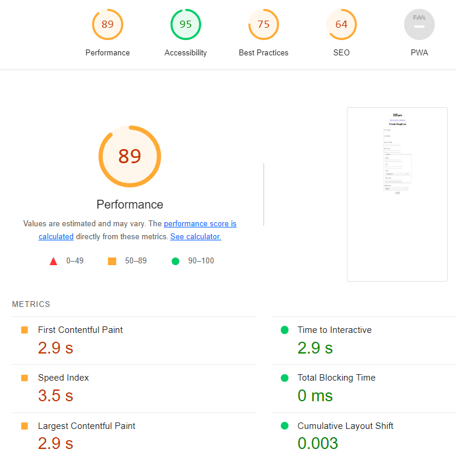
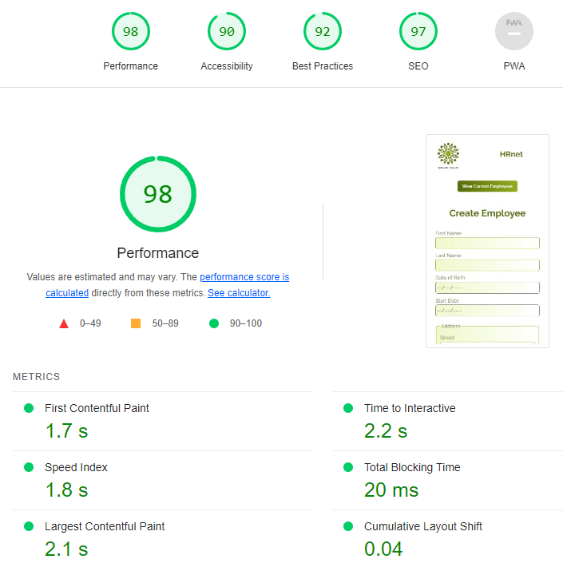

# Project 14 - Convert a jQuery library to React

## 1. General information
This repo contains all the source code to run the HRnet app.
HRnet manages employee HR records and was innitially written in jQuery.
I converted the whole app to React using only React components for performances purposes.

Github Repo for the original app:
- [jQuery repo](https://github.com/OpenClassrooms-Student-Center/P12_Front-end)

## 2. Project

### 2.1 Requirements

- Convert the whole application to React.
- Switch the sate management from local storage to a newer solution (I chose React Redux)
- Manually convert 1 component library to React (I chose the data table library).
- Run tests with Lighthouse to demonstrate the improvements made from converting to React.

### 2.2 Lighthouse results

Initial jQuery results:

Improuved React results:

### 2.3 Conclusion
-Converting the app to a more modern React app was the rigth decision and allowed us to create a faster, more reliable and future proof app.